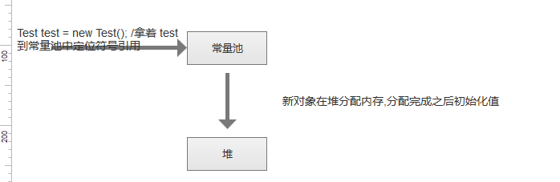
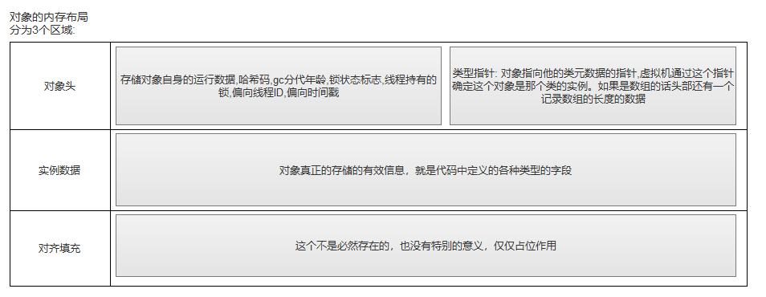
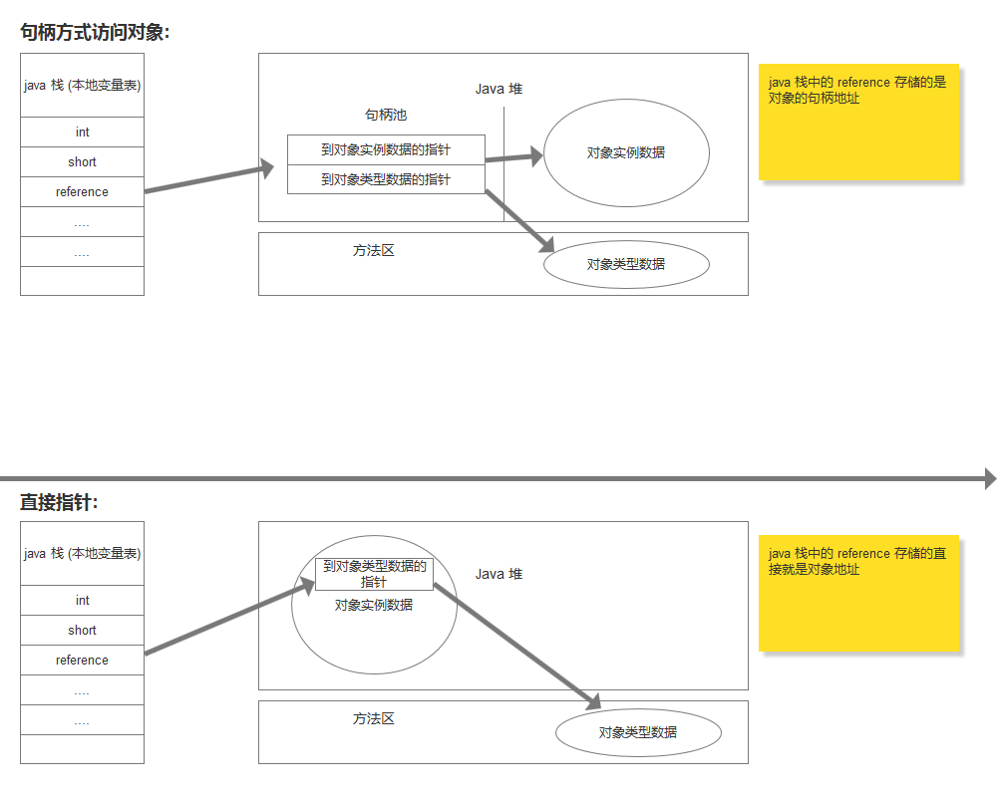

# Java 内存区域和溢出异常:

## 1. 运行时数据区 -  程序计数器：
&nbsp;&nbsp;&nbsp;&nbsp;程序计数器是一块较小的内存空间，可以看做当前线程所执行的自己吗行号指示器。字节码解释器工作时就是通过改变这个计数器的值来获取下一条需要执行的字节码指令,分支,循环,跳转异常处理线程恢复等基础功能都需要依赖这个计数器完成,java虚拟机的多线程是通过线程轮流执行切换并分配处理执行器执行时间来实现的。在任何一个确定的时刻，一个处理器都只会执行一条线程中的指令，为了线程切换户恢复到正确的执行位置，每个线程都需要一个独立的程序计数器，各个线程之间不影响，独立存储，我们称这类内存区域为 “私有线程” 的内存。   
&nbsp;&nbsp;&nbsp;&nbsp;如果线程正在执行一个 java 方法,这个计数器记录的是正在执行的虚拟机字节码指令的地址,如果正在执行的是 Native 方法,这个计数器的值为空,此内存区域是唯一一个在java 虚拟机规范中没有任何规定 OutOfMemoryError 的情况的区域 。       

## 2. 运行时数据区 -  虚拟机栈:   
&nbsp;&nbsp;&nbsp;&nbsp; 与程序计数器一样, java 虚拟机栈也是线程私有的,他的生命周期和线程相同,虚拟机栈描述的是 java 方法执行的内存模型: 每个方式在执行的同时都会创建一个栈帧用于存储具部变量表,操作栈,动态链接,方法出口等信息,每一个方法从调用直至执行完成的过程,就对用着一个栈帧在虚拟机栈中入栈到出栈的过程。      
&nbsp;&nbsp;&nbsp;&nbsp;  局部变量表中存放了编译期可知的各种基本数据类型： boolean, byte,char , short , int , float , long , double ,对象引用类型 ( 这个指的不是对象本身,指的是对象起始地址的引用指针,也可能是一个代表对象的句柄或者其他和对象相关的位置 ),returnAddress 类型 。   
&nbsp;&nbsp;&nbsp;&nbsp; 其中 64 位长度的 long 和 double 类型的数据会占用 2 个局部变量空间,其余的数据类型 只占用 1 个 。 局部变量表所需的内存空间在编译期间完成分配，当进入一个方式时，这个方法需要在帧中分配多大的局部变量空间是完全确定的，在方法运行期间不会改变局部变量表的大小 。
&nbsp;&nbsp;&nbsp;&nbsp; 在 java 虚拟机规范找你,对这个区域规定两种异常状况: 如果线程请求的栈深度大于虚拟机所允许的深度,将抛出 StackOverflowError 异常,果虚拟机栈可以动态的扩展,如果扩展是无法申请到足够的内存,就会抛出 OutOfMemoryError 异常。

## 3. 运行时数据区 -  本地方法栈: 
&nbsp;&nbsp;&nbsp;&nbsp; 本地方法栈与虚拟机栈所发挥的作用栈是相似的，他们之间的区别不过是虚拟机栈为虚拟机执行的 java 方法服务,而本地方法栈则为虚拟机规范中对方法栈中方法使用的语言,使用方式和数据结构并没有强制规定,因此局体的虚拟机可以自由实现它。 甚至可以将本地方法栈和虚拟机栈合二为一，本地方法栈也会抛出 StackOverFlowError 和 OutOfMemoryError 异常。

## 4. 运行时数据区 -  Java 堆: 
&nbsp;&nbsp;&nbsp;&nbsp;  对于大多数应用程序来说, java 堆是 java 虚拟机所管理的内存中最大的一块,java 堆是被所有线程共享的一块内存区域,在虚拟机启动创建时,几乎所有的对象实例都会在这里分配内存,这一点在 java 虚拟机规范中的描述是: 所有的对象的实例以及数组都要在堆上分配,但是随着 JIT 编译器的发展和逃逸分析技术的逐渐成熟,栈上分配,标量替换优化技术将会导致出现一些微妙的变化,所有的对象都在堆上分配渐渐的不是那么绝对。

## 5. 运行时数据区 -  方法区: 
&nbsp;&nbsp;&nbsp;&nbsp;  方法区和 java 堆一样,是各个线程共享的内存区域,他用于存储已被虚拟机加载的类信息,常量,静态变量,即时编译后的代码等数据。 当方法区无法满足内存分配需求时,将抛出 OutOfMemoryError 异常。

## 6. 运行时数据区 -  运行时常量池: 
&nbsp;&nbsp;&nbsp;&nbsp;  运行常量池是方法区的一部分， 用于存放编译期生成的各种字面量和符号引用，这部分内容在类加载后进入方法区的运行时常量池中。当常量池无法在申请到内存时会抛出 OutOfMemoryError 异常。

## 7. 运行时数据区 -  直接内存: 
&nbsp;&nbsp;&nbsp;&nbsp; 他是 NIO 类,基于通道和缓冲区的 I/O 方式,他可以通过 native 函数直接分配堆外内存。

## 8. 对象的创建: 

## 9. 对象的内存布局: 

## 10. 对象的访问定位: 
&nbsp;&nbsp; 建立对象是为了使用对象,我们的 java 程序需要通过栈上的 reference 数据来操作堆上的具体对象。 目前分为两种方式访问对象：句柄和直接指针。

&nbsp;&nbsp; 两种方式有各自的优势：     
&nbsp;&nbsp;&nbsp;&nbsp; 句柄访问：  reference 中存储的是稳定的句柄地址，在对象被移动是只会改变句柄中实例数据指针， 而 reference 不会改变。    
&nbsp;&nbsp;&nbsp;&nbsp; 直接指针：  节省了一次指针定位的时间，速度会提升。

## 11.OutOfMemoryError 异常: 