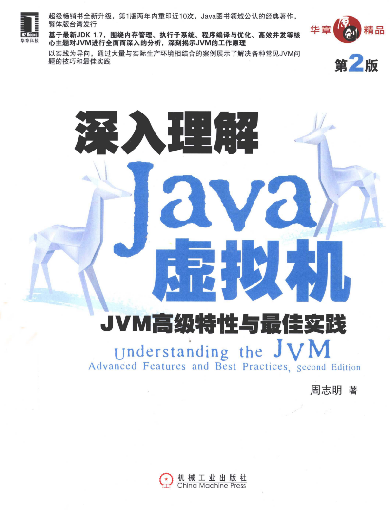

## 第二章: 自动内存管理机制
[ java 内存区域和内存溢出异常 ](01.内存区域和内存溢出异常.md)      
## 第三章: 垃圾收集器和内存分配策略
[ 垃圾收集器和内存分配策略 ](02.垃圾收集器和内存分配策略.md)      
## 第四章: 虚拟机性能监控和故障处理工具
[ 虚拟机性能监控和故障处理工具 ](03.虚拟机性能监控和故障处理工具.md)    
## 第六章: 类文件结构
[ 类文件结构 ](04.类文件结构.md)  