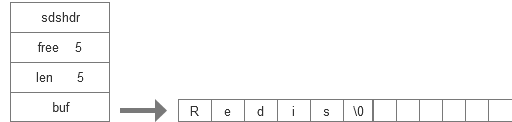

## 2.1 SDS 的定义 :


&emsp;&emsp; 在每个sds.h/sdshdr结构表示的 sds 值 :

```java
struts sdshdr{
    
    int  len;  //记录but数组中已使用的字节的数量,等于sds所保存的字符串长度

    int free;  // 记录but数组中未使用的的字节长度

    char but[]; //字节数组,用于保存字符串

}
```
&emsp;&emsp; free : 属性值为 0 , 表示这个 sds 没有分配任何未使用空间。   
&emsp;&emsp; len : 属性值为 5 , 表示这个 sds 表示存了5字节的长字符串。  
&emsp;&emsp; but : 属性值为 5 , 表示这个 sds 表示存了具体的字节,最后一个字节保存了    
&emsp;&emsp;&emsp;&emsp;'\0'。 因为 redis 是 c 语言编写,保存了 c 语言的语法。


&emsp;&emsp; 详解：  
   
buf 数组分配了 5 字节未使用的空间,buf 占用了 5 字节的使用了空间。中间自动添加了一个 '\0' 分隔符。

## 2.1 SDS 与 c 字符串的区别 :
&emsp;&emsp; 1.  获取存储长度不同 :   
&emsp;&emsp;&emsp;&emsp; c 语言不记录长度信息,如果想要获取长度,必须要遍历整个字符串。直到遇到空格符结束。 获取长度的复杂度为 O(n)。   
&emsp;&emsp;&emsp;&emsp; sds 存储了字符串的长度,所以获取长度的复杂度为 O(1)。   
&emsp;&emsp; 2.  缓冲溢出 :   
&emsp;&emsp;&emsp;&emsp; 因为c不记录长度,在执行strcat函数时,假设分配了内存,存储的内容比已分配的内存要多,这个时候会出现缓冲区溢出。   
&emsp;&emsp;&emsp;&emsp; sds 在存储内容时, 先检查存储的内容是否能够存下实际存的值,如果不满足,先将缓冲区扩张成能够存下值的大小,再将真实数据存下去  。   
&emsp;&emsp; 3.  修改字符串在内存中分配的次数 :     
&emsp;&emsp;&emsp;&emsp; c 在修改字符串的时候, 如果忘记对内存区域的扩展和减小,都会出现缓冲溢出和泄露。
&emsp;&emsp;&emsp;&emsp; SDS 采用了2中方式:  
&emsp;&emsp;&emsp;&emsp;&emsp;&emsp; 3.1 空间预分配 :  
```java

    // 先进行内存区域进行扩展,然后在执行下面的代码
    public void  test(){
        if(len < 1M){
            程序分配和len属性一样的大小未使用的空间。
        }else if(len > 1M){
            程序分配1M 未使用的空间。
        }
    }
```
&emsp;&emsp;&emsp;&emsp;&emsp;&emsp; 3.2 惰性空间释放 :  
&emsp;&emsp;&emsp;&emsp;&emsp;&emsp;&emsp;&emsp; 在修改字符串时，先不会将多余的空间修改掉，用 free 保存下来,等下次再次修改字段长度时,使用这次的空间。   
&emsp;&emsp; 4.  二进制安全 :     
&emsp;&emsp;&emsp;&emsp; C 必须存储指定的格式数据。   
&emsp;&emsp;&emsp;&emsp; SDS 不会对数据限制。
&emsp;&emsp; 5.  兼容 c 符串函数 :   
&emsp;&emsp;&emsp;&emsp; sds 总会在保存数据最后添加一个空字符,是为了重用 <string.h>  库定义的函数。  