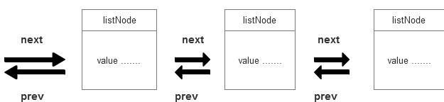

## 1. 链表 -- 简介:
&nbsp;&nbsp; 每个链表节点使用一个adlist.h/listNode 结构表示。
```java
typedel struct listNode {
    struct listNode prev; // 前置节点

    struct listNode next; // 后置节点

    void value;   // 节点的值

}listNode
```
&nbsp;&nbsp;多个 listNode 可以通过 prev 和 next 组成双端链表:


虽然仅仅使用多个 listNode 结构可以组成链表,但使用 alist.h/list 来持有链表的话,操作数据会更方便:

```java
typedel struct list {
    listNode head; // 表头节点

    listNode tail; // 表尾节点

    unsigned long  len;   // 链表所包含的节点数量

    void (dup)(void ptr) ; // 节点复制函数

    void (free)(void ptr) ; // 节点值释放函数

    int (match ptr  void key); // 节点值对比函数

}list
```
TODO:// 这个地方需要确认一下

