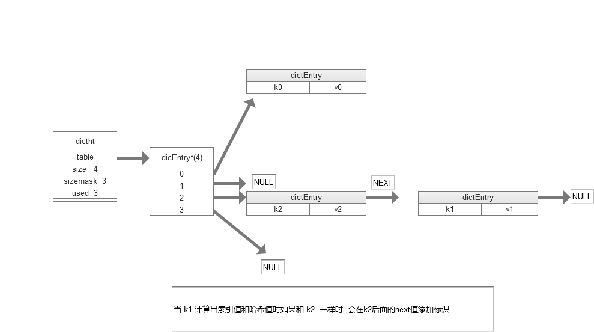

## 1. 简介 : 
&nbsp;&nbsp;字典:    
&nbsp;&nbsp;&nbsp;&nbsp; 称符号表,关联数组,映射,是一种保存键值对的抽象数据结构。在字典中每个 key 是唯一的。当哈希包中的值多或者键值对中有较长的字符串时,redis 就会使用字典作为哦哈希表的底层实现。

## 2. 哈希表 -- 定义 : 
&nbsp;&nbsp; redis 字典所使用的哈希表由 dict.h/dictht 结构定义:
```java
typedel struct dictht {
    dicEntry table ; // 哈希表数组

    unsigned long size; // 哈希表的大小

    unsigned long  sizemask; // 哈希表大小的掩码,用于计算索引值

    unsigned long  used ; // 该哈希表已有的节点数量

}dictht
```
&nbsp;&nbsp; table :   
&nbsp;&nbsp;&nbsp;&nbsp; table 属性是一个数组,数组中的每个元素都是指向 dict.h/dictEntry 结构指针,每个 dictEntry 结构保存着一个键值对。   
&nbsp;&nbsp; size :   
&nbsp;&nbsp;&nbsp;&nbsp; size 属性记录了哈希表的大小,就是 table 数组的大小。  
&nbsp;&nbsp; used :   
&nbsp;&nbsp;&nbsp;&nbsp; used 属性记录了哈希表当前已有节点的数量 。     
&nbsp;&nbsp; sizemask :   
&nbsp;&nbsp;&nbsp;&nbsp; sizemask 属性值总是等于 size() - 1 这个属性和哈希值一起决定一个键应该放在 table 数组的那个索引上 。     


## 3. 哈希表节点 -- 定义 : 
&nbsp;&nbsp; 哈希表节点使用 dictEntry 结构表示,每个 dictEntry 结构都保存着一个键值对:
```java
typedel struct dicEntry {
    void key ; // 键

    union {    //值
        void val ;
        uin64_tu64 ;
        in64_tu64
    }v

    struct dicEntry next; // 执向下一个哈希表节点,形成链表

}dicEntry
```
&nbsp;&nbsp; key :   
&nbsp;&nbsp;&nbsp;&nbsp; key 属性保存着键值对中的键。      
&nbsp;&nbsp; val :   
&nbsp;&nbsp;&nbsp;&nbsp; val 属性保存着键值对中的值,值可以是一个指针,或者是一个   uin64_tu64 整数, 或者是一个   in64_tu64 整数 。
&nbsp;&nbsp; next :     
&nbsp;&nbsp;&nbsp;&nbsp; next 属性执向另一个哈希表节点的指针, 这个指针可以将多个哈希值相同的键值对链接一次,以此来解决键冲突的问题 。   

## 3. 字典 -- 定义 : 
```java
typedel struct dict {
    dictType *type ; // 典型特定函数

    void *private ;  // 私有数据

    dicththtp[2] ;   // 哈希表

    in trehashudx ;  // rehashing not in progress ifrehashidx =-1  当rehash不在进时,值为 -1

}dict
```
type 属性和 private 属性是针对不同类型的键值对,为创建多态字典而设置的。   
&nbsp;&nbsp; type :   
&nbsp;&nbsp;&nbsp;&nbsp; type 属性是一个指向 dictType 结构的指针,每个 dictType 结构保存了一簇用于操作特定类型键值对的函数, redis 会为用途不同的字典设置不同的类型特定函数。       
&nbsp;&nbsp; private :      
&nbsp;&nbsp;&nbsp;&nbsp; private 属性保存了需要传给那些类型特定函数的可选参数。  
```java
typedef struct dictType {
    unsigned  ht(*heshFunction)(const void *key) ; // 计算哈希值的函数

    void (*keyDup)(void * privdate , const void * key)  ;  // 复制键的函数
    
    void (*valDup)(void * privdate , const void * ob)  ;  // 复制值的函数

    void (*keyCompare)(void *privdate , const void *key ,const void *key2)  ;  // 对比键的函数

    void (*keyDestructcr)(void *privdate , const void *ob)  ;  // 销毁键函数

    void (*valDestructcr)(void *privdate , const void *ob)  ;  // 销毁值ht函数

}dictType
```
ht 属性是一个包含两个项的数组,数组中的每一项都是一个dicht哈希表,一般情况下字典只使用ht[0] 哈希表,ht[1] 哈希表只会对 ht[0]  哈希表进行 rehash 是使用。除了 ht[1] 外，另一个和rehash 有相关的属性就是rehashidx , 他记录了 rehash 目前的进度, 如果目前灭有进行 rehash 那么他的值是  -1 。    


## 4. 哈希算法 : 
&nbsp;&nbsp;  当要将一个新的键值对添加到字典里面时，程序需要先根据键值对的键计算出哈希值和索引值，再根据索引值，将包含新键值对的哈希表节点放到哈希表数组的指定的索引上面。    
&nbsp;&nbsp;  具体实现 :
```java
# 使用字典设置的哈希函数,计算出键 key 的哈希值
hash = dict -> type -> hashFunction(key);

# 使用哈希表的sizemesk的属性和哈希值,计算出索引值
# 根据情况不同, ht[x] 可以是 ht[0] 或 ht[1]
index = hash & dict -> ht[x]sizemask;

```

## 5. 解决键冲突 : 
&nbsp;&nbsp;  当有两个或两个以上数量的键被分配到了哈希表数组的同一个索引上面时,称为键发生了冲突。redis 的哈希表使用链地址法来解决键冲突,每个哈希表节点有有一个next指针,多个哈希表节点可以使用指针构成一个单项链表,被分配到同一个索引上的多个节点可以用这个单项链表链接起来。 如下图： 

