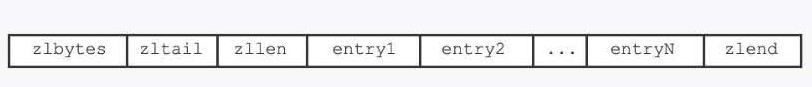
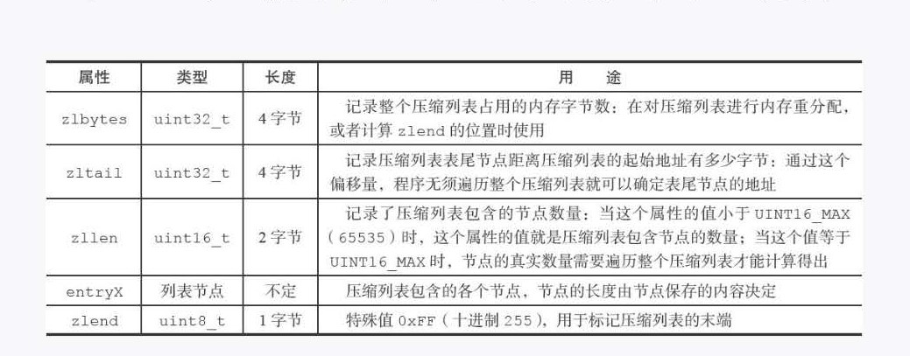

## 1.简介:
&nbsp;&nbsp;  压缩列表:       
&nbsp;&nbsp;&nbsp;&nbsp; 压缩列表是列表键和哈希键的底层实现之一,当一个列表键只包含少量的列表项, 并且每个列表项要么就是最小的整数值,要么就是长度比较短的字符串,那么 redis 就会使用压缩列表来作为链表键的底层实现。    
## 2. 压缩列表的构成 : 
&nbsp;&nbsp; 压缩列表是 redis 为了节约内存开发的,是由一系列的特殊编码的连续内存块组成的顺序性的数据结构。 一个压缩列表可以包含多个节点，每个节点可以保存一个字节数组或者一个整数值。   

## 3. 压缩列表节点构成 : 
&nbsp;&nbsp; 1.  每个压缩列表节点可以保存一个字节数组或者一个整数值。   
&nbsp;&nbsp;&nbsp;&nbsp; 数组的长度取值：  
&nbsp;&nbsp;&nbsp;&nbsp;&nbsp;&nbsp;  1. 长度小于等于 63 字节的字节数组 2. 长度小于  16383 字节数组 3. 长度小于 4294967295 字节数组     
&nbsp;&nbsp;&nbsp;&nbsp; 整数值的取值：    
&nbsp;&nbsp;&nbsp;&nbsp;&nbsp;&nbsp;  4位长,介于0至12之间的无符号整数    
&nbsp;&nbsp; 2.  每个压缩列表节点由 previous_entry_length,encoding,content 三部分组成。    
&nbsp;&nbsp;&nbsp;&nbsp; previous_entry_length ：  
&nbsp;&nbsp;&nbsp;&nbsp;&nbsp;&nbsp;  节点的  previous_entry_length 属性以字节为单位，记录了压缩列表的前一个节点的长度，previous_entry_length 属相的长度可以为1字节或者5字节。    
&nbsp;&nbsp;&nbsp;&nbsp; encoding ：  
&nbsp;&nbsp;&nbsp;&nbsp;&nbsp;&nbsp;  节点的  encoding 记录了节点 content 属性所保存的类型和长度。      
&nbsp;&nbsp;&nbsp;&nbsp; content ：  
&nbsp;&nbsp;&nbsp;&nbsp;&nbsp;&nbsp;  节点的  content 记录了节点的值。

## 4. 连锁更新 : 

TODO: