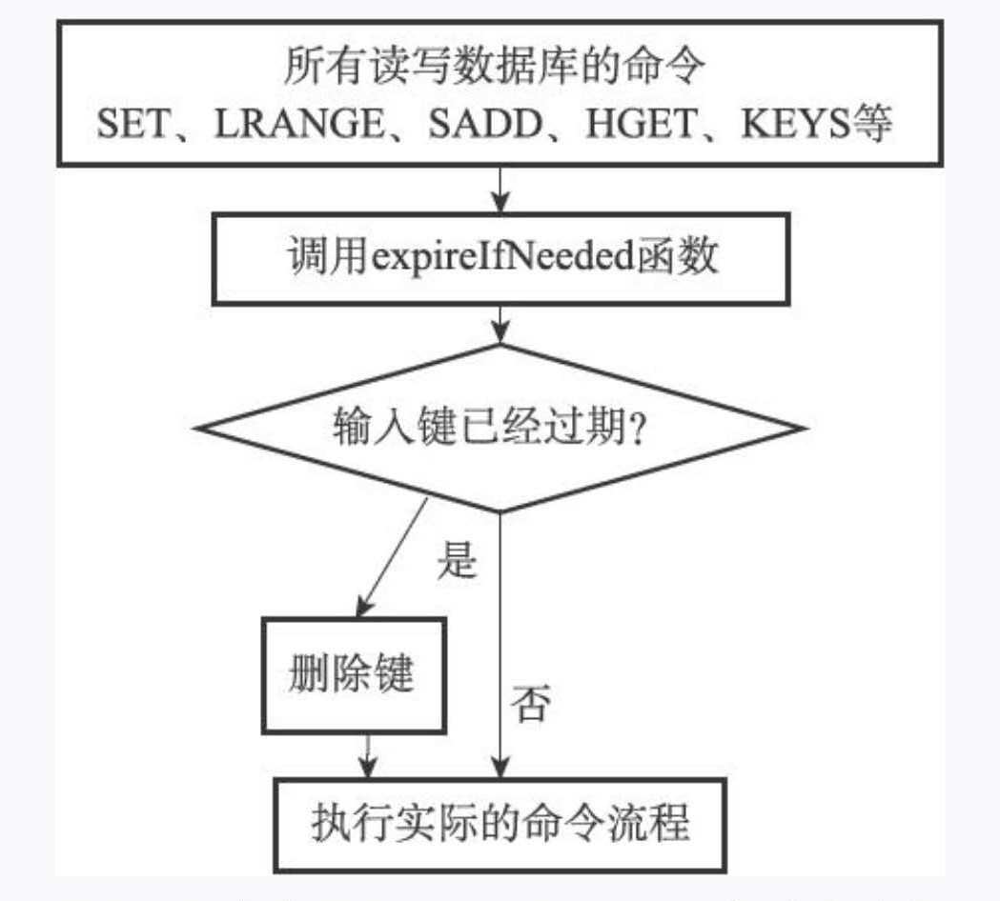
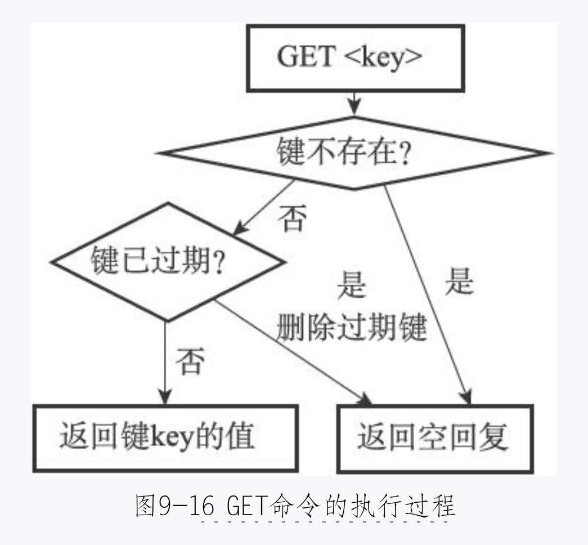

## 1. 服务器中的数据库
&nbsp;&nbsp;  redis 服务器将所有的数据库都保存在服务器状态 redis/redisServer 结构的 db 数组中,db 数组的每一项都是 redis.h/redisDb 结构,每一个  redisDb 结构代表一个数据库:
```java
strust redisServer{
       // ....
       redisDB *db; // 一个数组,保存着服务器中所有的数据库

       int dbnum;   // 服务器的数据库数量,dbnum 属性的值由服务器的配置的 database 选项决定的, 默认会初始化 16 个数据库。
       //....
}
```

## 2. 切换数据库
&nbsp;&nbsp; 通过 SELECT 命令来切换数据库


## 3. 数据库键空间
&nbsp;&nbsp; redis 是一个键值对数据库服务器,服务器中每个数据库都由一个 redis.h/redisDb 结构表示,其中 redisDb 结构中的 dict 字典保存了数据库中的所有的键值对,称为键空间 。 键空间中的键对象对应的就是数据库中的键。

```java
strust  strust redisDB{
       // ....
         dict *dict ; // 数据库键空间,保存着数据库中所有的键值对
       //....
}
```

## 4. 添加新键   
```
 set msg "lidong"
```

## 5. 删除键   
```
 DEL msg 
```

## 6. 更新键   
&nbsp;&nbsp;  根据类型的不同更新方式不一样,这里写一种 。
```
 set msg "lidong"
```

## 7. 对键取值
&nbsp;&nbsp;  根据类型的不同获取方式不一样,这里写一种 。
```
 get msg 
```

## 8. 设置键的生存时间和过期时间
&nbsp;&nbsp;  设置过期时间的四种方式：
```java
      1.   expire <key> <ttl>  // 用于将键的 key 的生存时间设置成 ttl 秒
      2.   pexpire  <key> <ttl> //用于将键的 key 的生存时间设置成 ttl 毫秒
      3.   expireat  <key> <timestamp> //用于将键的 key 的过期时间设置为 timestamp 所指定的秒数时间戳
      4.   pexpireat <key> <timestamp> //用于将键的 key 的过期时间设置为 timestamp 所指定的毫秒数时间

```

## 9. 保存过期时间
&nbsp;&nbsp;  redisDb 结构的 expires 字典中保存了数据库中所有键的过期时间，称为过期字典。过期字典中的键是一个指针，这个指针指向的是键空间中某个键对象 。 过期字典中的值是一个 long 类型整数，保存的是过期时间。


## 10. 移除过期时间

```
    PERSIST <KEY>
```

## 11. 计算并返回剩余生命时间
&nbsp;&nbsp;  TTL   命令是以秒单位返回键的剩余时间     
&nbsp;&nbsp;  PTTL  命令是以毫秒为单位返回键的剩余时间

## 12. 过期键删除策略
&nbsp;&nbsp;  三种不同策略的 ：   
&nbsp;&nbsp;&nbsp;&nbsp; 1. 定时删除 :   
&nbsp;&nbsp;&nbsp;&nbsp;&nbsp;&nbsp; 在设置键的时间的同时，创建一个定时器，让定时器在键过期时间来临时，立刻执行删除操作。  
&nbsp;&nbsp;&nbsp;&nbsp;&nbsp;&nbsp;  优点：      
&nbsp;&nbsp;&nbsp;&nbsp;&nbsp;&nbsp;&nbsp;&nbsp;&nbsp;  能够及时的删除过期的键。  
&nbsp;&nbsp;&nbsp;&nbsp;&nbsp;&nbsp;  缺点：     
&nbsp;&nbsp;&nbsp;&nbsp;&nbsp;&nbsp;&nbsp;&nbsp;&nbsp;  在内存不紧张的情况但是CPU紧张的情况下,会占用从CPU 。创建定时器，需要用到 redis 时间事件,这个获取时间的复杂度比较高,用这种方式处理过期的键不现实。    

&nbsp;&nbsp;&nbsp;&nbsp; 2. 惰性删除 :     
&nbsp;&nbsp;&nbsp;&nbsp;&nbsp;&nbsp; 放任过期键不管,但是每次从键空间获取键时, 就检查键是否过期,如果过期就删除键,如果没有过期,返回键。      
&nbsp;&nbsp;&nbsp;&nbsp;&nbsp;&nbsp;  优点：      
&nbsp;&nbsp;&nbsp;&nbsp;&nbsp;&nbsp;&nbsp;&nbsp;&nbsp;  对 CPU 友好。   
&nbsp;&nbsp;&nbsp;&nbsp;&nbsp;&nbsp;  缺点：     
&nbsp;&nbsp;&nbsp;&nbsp;&nbsp;&nbsp;&nbsp;&nbsp;&nbsp; 对内存不优好,如果一个键过期了,不删除的话,会占用内存。 

&nbsp;&nbsp;&nbsp;&nbsp; 3. 定期删除 :     
&nbsp;&nbsp;&nbsp;&nbsp;&nbsp;&nbsp; 每隔一段时间，程序就对数据库进行检查一次，删除里面过期的键，至于删除多少过期的键，由算法决定。

&nbsp;&nbsp; redis 使用的是惰性删除和定期删除两种策略配合 。

## 13. 惰性删除策略的实现
&nbsp;&nbsp;  过期键的惰性删除策略由 db.c/expirefNeeded 函数实现,所有读写数据库的redis  命令前都会调用 expirlfNeeded 函数对输入进行检查,下面的流程是惰性删除的执行过程:



## 14. 定期删除策略的实现
&nbsp;&nbsp; 过期键定期删除策略由 redis.c/astiveExpireCycle 函数实现,每当 redis 的服务器周期性操作 redis.c/serverCron 函数执行时,  astiveExpireCycle 函数就会被调用,他在规定的时间内,分多次遍历服务器中各个数据库, 从数据库中的 expire 字典中随机检查一部分键的过期时间,并删除过期的键。

## 15. AOF,RDB和复制功能对过期键的处理-- 生成 RDB 文件
&nbsp;&nbsp;  在执行 save 命令或者 bgsave 命令创建一个新的 RDB 文件时, 程序会对数据库中的键进行检查,已过期的键不会保存到文件中。

## 16. AOF,RDB和复制功能对过期键的处理-- 加载RDB 文件
&nbsp;&nbsp; 在启动 redis 服务时, 服务器会开启 Rdb 功能, 服务器会对 RDB 文件进行加载。  如果是以主服务器模式运行,在加载 rdb 文件时,会对键进行检查,如果键已经过期,就不会加载到数据库中。 如果是从服务器模式启动，会将所有的键加载进数据库中,但是当从服务器数据进入主服务器时,会将过期的键过滤掉。    

## 17. AOF,RDB和复制功能对过期键的处理-- AOF文件写入
&nbsp;&nbsp; 当服务器以 aof 模式运行时,如果数据库中的某个键已经过期,但是没有被惰性删除或者定期删除,会在aof文件中加一个 del 语句。   

## 17. AOF,RDB和复制功能对过期键的处理-- AOF重写
&nbsp;&nbsp; 和生成 RDB 文件类似,在执行 AOF 重写过程中,程序会对键进行检查,将已经过期的键过滤掉。

## 18. AOF,RDB和复制功能对过期键的处理-- 复制
&nbsp;&nbsp;  当服务器运行在复制模式下是，从服务器过期键删除动作有主服务器控制，如果客户端向从服务器发起请求，即使键已经过期，从服务还是会将值返回给客户端，如果客户端调用主服务器，主服务器发现键已经过期了，会返回空，将过期的键进行删除，然后发送消息给从服务器，将从服务器中过期的键删除。