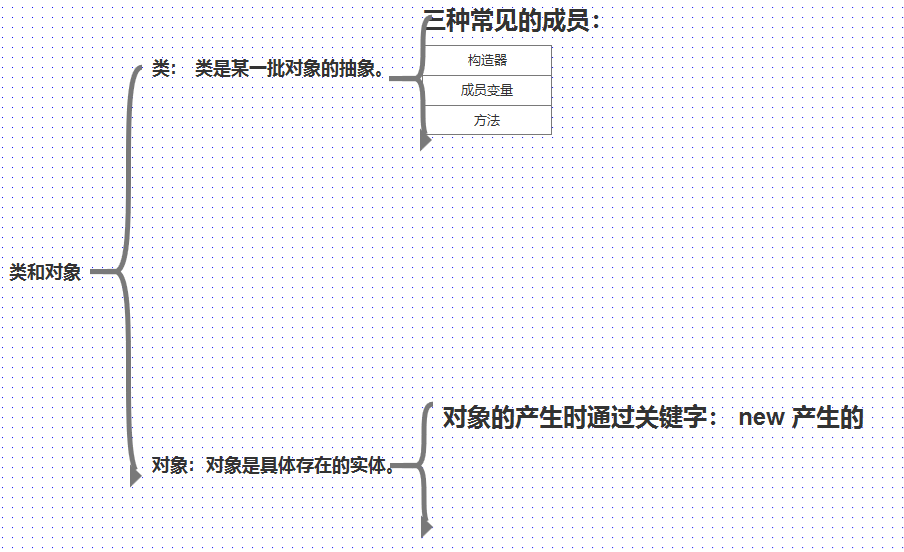
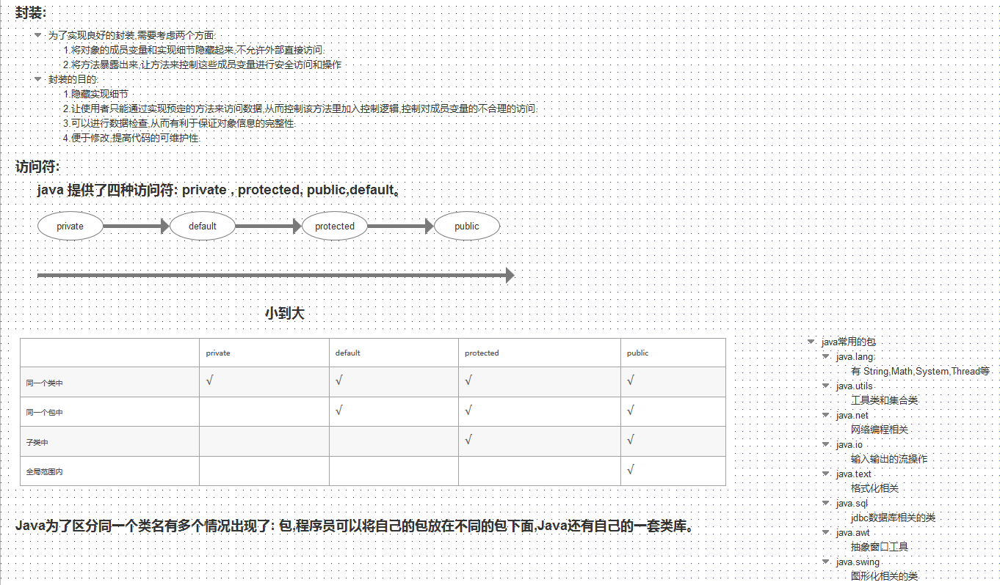
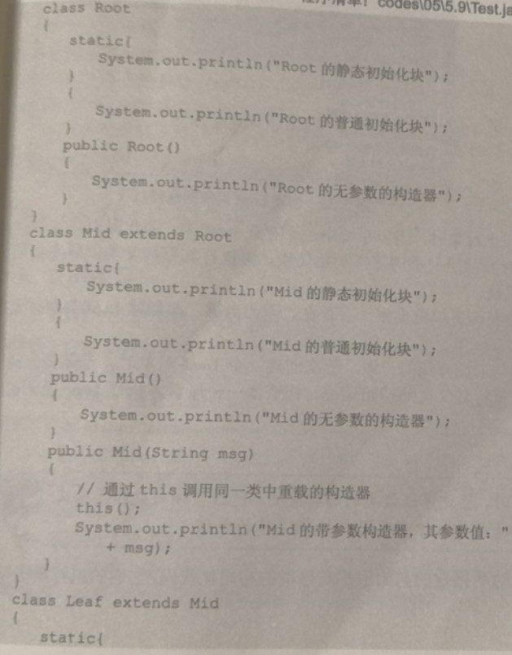
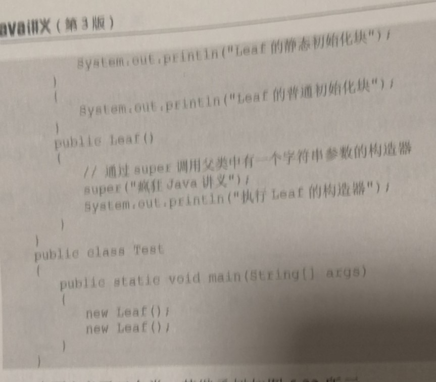
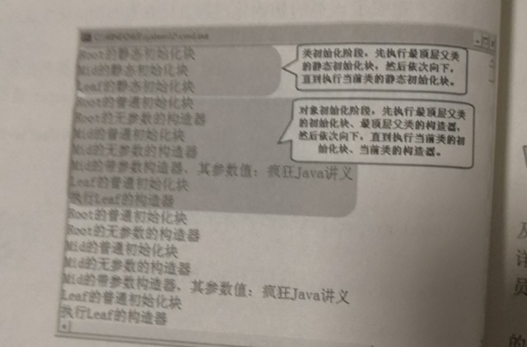

# 1.类和对象--定义类：


# 2.this 关键字：


# 3. 方法的传递机制：

# 4. 方法重载：
在同一个类中,方法名相同,方法的參數或者类型不同。与其他都无关。

# 5. 成员变量和局部变量：


# 6. 封装：


# 7. 构造器：
构造器最大的作用是初始化对象,如果程序员没有显示的声明一个构造器,系统会给一个空的构造器。如果程序員給了一个显示的构造器,默认的构造器就不会有,如果想要有默认的构造器,必须显示的声明一下。

# 8. 类的继承：
继承通过关键字 extends 来实现。
在具有继承关系的两个类中实现 extends 关系的两个类,才有重写,重写是方法名,参数一致,只是代码块不一样,才是重写。

# 9. super

# 10. 多态:
java 引用变量有两种类型: 一种是编译时类型,一种是运行时类型。编译时类型有声明该变量时使用的类型决定,运行时类型是实际赋给该变量的对象决定的。编译时类型和运行时类型不一致,就能出现所谓的多态。

# 11. 初始化块:
初始化块在构造器之前执行:
```
语法:
        {}
```

# 12. 静态始化块:
静态初始化块使用 static 修饰,称为类初始化块,静态初始化块是在类初始化阶段执行的,而不是在对象创建时执行的。
```
语法:
        static{}
```


下面是构造器,初始化代码块和静态初始化代码块执行的过程:


