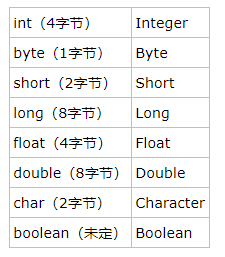
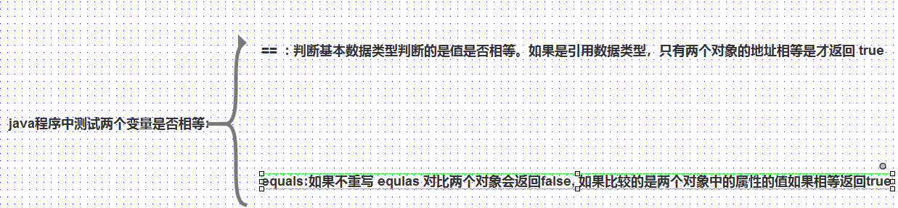

# 1. java 8 增强的包装类：
基本数据类型对应的包装数据类型:  
  
基本数据类型可以通过自动装箱向上转型。
还可以通过包装类型的静态方法： parseXXX(String s) 。

# 2.  == 和 equls 方法:
 

# 3.  单例:

# 4.  final:
> 基本用法：
>>在 java 中,final 关键字可以用来修饰类,方法和变量(包括成员变量和局部变量)   

> 1.修饰类:
> > 当 final 修饰类的时候,表明这个类不能被继承 。

> 2. 修饰方法:
> > 如果想明确的禁止该方法在子类中不能使用,可以将方法设置成 final。 

> 3. 修饰变量:
> > final 修饰成员变量,只能被赋值一次,赋值之后不能再改变。
> > final 修饰一个基本数据类型,表示该基本数据类型的值一旦初始化就不能改变,如果修饰的是一个引用数据类型,就不能指向其他对象了,但是对象的内容是可以改变的，就是地址不会改变。　final修饰一个成员变量（属性），必须要显示初始化。这里有两种初始化方式，一种是在变量声明的时候初始化；第二种方法是在声明变量的时候不赋初值，但是要在这个变量所在的类的所有的构造函数中对这个变量赋初值。当函数的参数类型声明为final时，说明该参数是只读型的。即你可以读取使用该参数，但是无法改变该参数的值。

# 5.  抽象类和抽象方法:
> 抽象方法和抽象类必须使用 abstract 修饰符定义,有抽象方法的类只能定义成抽象类,抽象类中可以没有抽象方法。
> > 1. 抽象类必须使用 abstract 修饰符来修饰,抽象方法也必须使用 abstract 修饰符来修饰,抽象方法不能有方法体。
> > 2. 抽象类不能被实例化,无法使用 new 关键字来调用抽象类的构造器创建抽象类的实例。
> > 3. 抽象类可以包含成员变量,方法,构造器,初始化块,内部类,抽象类的构造器不能创建对象,主要是给子类对象调用。
> > 4. 含有抽象方法的类只能是抽象类。
> > 5. abstract 不能修饰成员变量,不能修饰局部变量,  abstract 不能修饰构造器。
> > 6. 抽象类的主要作用是相当于一个模板,其他的功能交给子类去实现。

