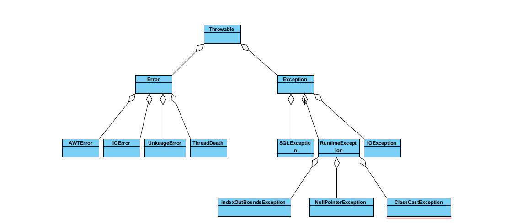

# 1. 异常的继承机制:

# 2. 异常的执行机制:
先处理小异常,再处理大异常。所以一般将 Exception 异常放到 catch 最后。
# 3. java 7 的多异常捕获:
> 1.捕获多种类型的异常时,多种异常类型之间用 ( | ) 隔开。  
> 2.捕获多种类型的异常时，异常变量有隐式的 final 修饰,因此程序不能对异常变量重新赋值。

```java
    语法:
    try{
            //执行代码块
    }catch(IndexOutBoundsException | NumberFormationException|Arithmetiception ie){
             //小的异常处理
    }catch(Exception e){
             //定义异常
    }
```
# 4. 异常信息打印:
> * getMessage() : 返回该异常的详细描述字符串。
> * printStackTrace() : 将该异常的跟踪栈信息输出到标准错误输出。
> * printStackTrace(PrintStream s) : 将异常信息输出到指定的文件中。
> * getStackTrace() : 返回该异常的跟踪栈信息。

# 5. 使用 finally 回收资源:
```java
    语法:
    try{
        // 业务实现代码
    }catch(子类型的异常信息1 e){
        //异常处理块
    }catch(子类型的异常信息2 e){
        //异常处理块
    }finally{
        //资源回收
    }

```
在异常捕获的语法中,try 是必须的,catch 和 finally 是可以选择的。即使在 catch 中进行了 retrun ,finally 中的代码也会执行。

# 6. 使用 throws 声明抛出异常:
在方法上使用  throws 抛出异常信息,就是让调用者来处理异常,如果都没有处理,最后会直接返回到页面上。      
注意：   
    在使用的 throws 声明抛出异常时有一个限制，就是方法重写时 "两小" 中的规则,子类方法声明抛出的异常信息类型应该是父类方法抛出的子类或者相同,子类方法声明抛出的异常不允许比父类的方法声明抛出的异常多。    


# 7. 使用 throw 抛出异常:
当程序出现错误时,系统会自动抛出异常,但是还有需要程序员主动抛出异常处理,所以 java 提供了 throw 供程序员使用。
```java 
    语法:
        throw new Exception("错误信息");

```
# 8. 自定义异常:
```java
    事例:
        public class AuctionEcception extends Exception{
            //无参数构造器
            public AuctionEcception(){}
            //带一个参数的构造函数
            public AuctionEcception(String msg){
                super(msg);
            }
        }

```