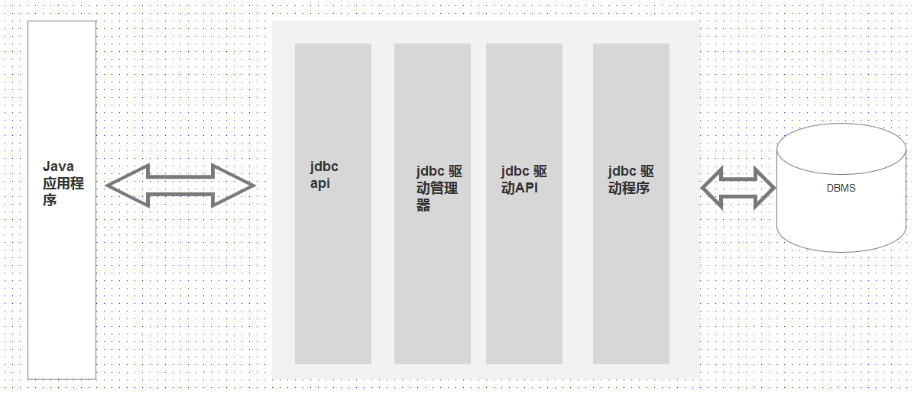

# 1. 简介:
使用 jdbc, 就可以使用同一套 api 访问不通的数据库系统。
sun 公司提供的 jdbc 可以完成下面三种工作:
> 1. 建立与数据库的链接
> 2. 执行 sql 语句
> 3. 获取 sql 执行的结果

# 2. JDBC 驱动程序:
数据库驱动是 jdbc 程序和数据库之间的转换层, 数据库驱动程序负责将 jdbc 调用映射成特定的数据库调用。大部分数据库系统,都有相应的 JDBC 驱动程序,当需要连接某个特定的数据库时,必须有相应的数据库驱动程序。
        

JDBC 驱动通常有下面 4 中类型:
> 1. JDBC-ODBC 桥,最早的 jdbc 驱动程序,主要目的是为了快速推广 jdbc, 这种驱动将 jdbc api 映射到 odbc api,但是在 java8中被删除了。

> 2. 直接将 jdbc api 映射成数据库特定的客户端 API, 这种话驱动包含特地数据库的本地代码,用于访问特定的数据库的客户端。

> 3. 支持三层的 JDBC 访问方式,主要用于 applet 阶段,通过 applet 访问数据库。

> 4. 是纯 java 的,直接和数据库交互,这种驱动是智能的,他知道数据库使用的底层协议,这个是现在最流行的 jdbc 驱动。

# 3. 安装数据库:
略

# 4. mysql 基本命令:
> 1. mysql 数据库的一个实例可以包含多个数据库,查看当前实例下有多少个数据库:      
>  show databases;

> 2. 创建数据库:    
>  create database [IF NOT EXISTS] 数据库名;

> 3. 删除数据库:
>  drop database 数据库名;

> 4. 使用数据库:
>   use 数据库名;

> 5. 查看数据库下有多少张表:
>   show tables;

> 6. 查看表结构:
>   desc 表名;

> 7. 使用客户端链接数据库:
> mysql -p 密码 -u 用户名 -h 主机名 --dafault-character-set=utf-8

mysql 数据库通常支持两种存储机制:   
> 1. MyISAM:       
>   这个是 mysql 最早默认的存储机制,对事物支持不够好。

> 2. InnoDb:
>   提供事物安全的存储机制,保证事物的完整性。 mysql 5.0 以上默认使用这种存储机制。

# 5.  sql 语句基础:
sql 语句同好穿那个分为下面几种类型:
> 1. 查询语句:
>   主要使用 select 关键字完成,查询语句是 sql 语句中最复杂,功能最丰富的语句。

> 2. DML 语句:
>   主要有 inset , update 和 delete 三个关键字组成。

> 3. DDL 语句:
>   主要有 create, alter, drop 和 truncate 关键字完成。

> 4. DCL 语句:
>   主要有 grant和revoke 关键字完成。

> 5. 事物控制语句:
>   commit,rooback和savepoint 关键字完成。
