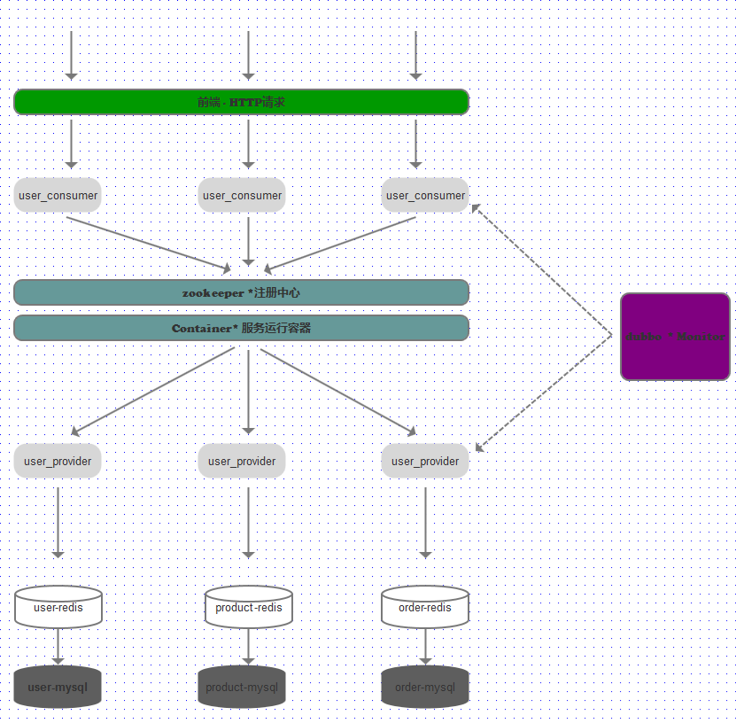

# 1. 微服务架构设计图(v1)

> 1. 浏览器请求到提供服务的各个 consumer 中,  consumer 订阅在 zookeeper 中的 provider 提供的服务。

> 2. provider 启动时将服务注册在容器中。

> 3. 容器将 provider 服务提供的地址返回给 consumer ，供 consumer 调用。

> 4. 服务的消费者，基于软负载从服务中获取一条可以用的消息，如果调用失败，就会调用另一台。

