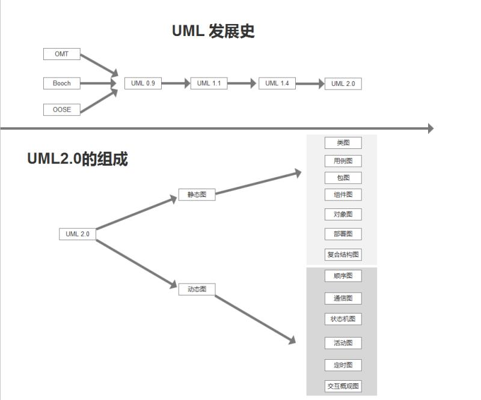

# 简介：
&nbsp;&nbsp; 面向对象开发需要经过 OOA(面向对象分析)，OOD(面向对象设计)，OOP(面向对象编程) 三个阶段。    
&nbsp;&nbsp;&nbsp;&nbsp; OOA :     
&nbsp;&nbsp;&nbsp;&nbsp;&nbsp;&nbsp; 对目标系统进行分析，建立分析模型。并将之文档化。     
&nbsp;&nbsp;&nbsp;&nbsp; OOD :    
&nbsp;&nbsp;&nbsp;&nbsp;&nbsp;&nbsp; 面向对象的思想对 ooa 的结果细化，得出设计模型。

&nbsp;&nbsp; UML 是一种定义良好，易于表达的，功能强大且普遍适用的建模语言，他的作用域不限于支持面向对象的分析和设计，还支持从需求分析开始的软件开发的全过程。  

&nbsp;&nbsp; 下面是 uml 发展史和 uml 相关的图例：

