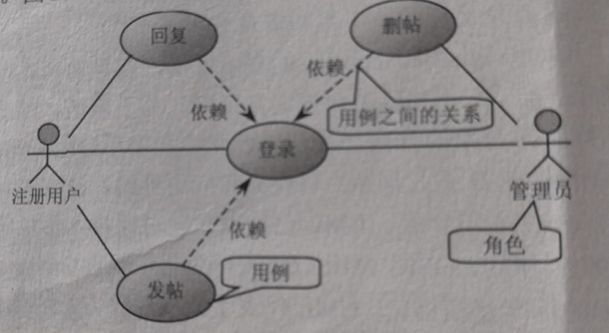
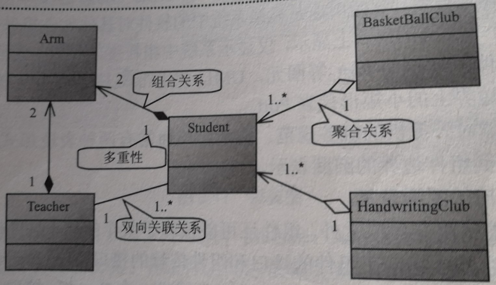
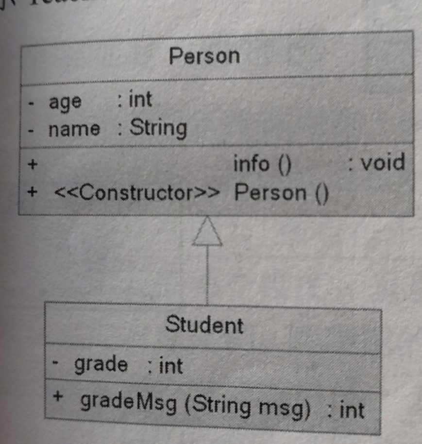
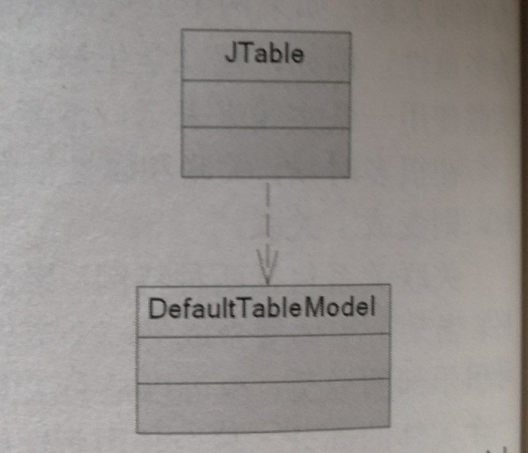
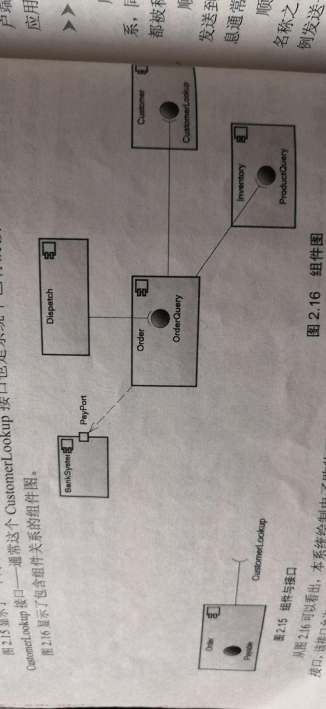
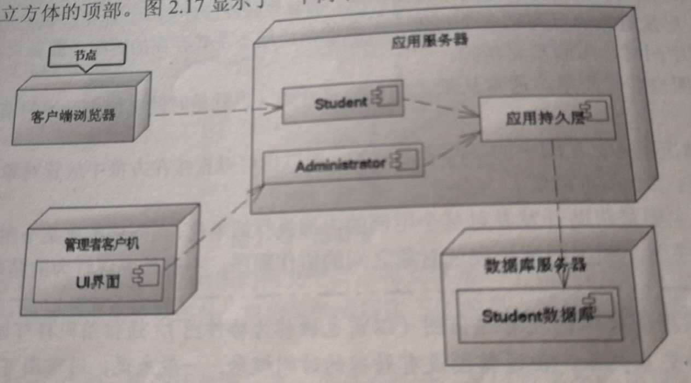

# 1. 用例图：
##  主要是对系统功能的描述。

# 2. 类图：
## 类图表示系统中应该包含哪些实体，各个实体之间的关系。

下图是类图中类的表示方法：

类图出来可以表示实体的静态内部结构外，还可以表示实体之间的相互关系。类之间的三种基本关系是：关联（包括聚合，组合），泛化（与继承一个概念），依赖。       
## 关联：
&nbsp;&nbsp; 如果仅能从一个类单方向的访问另一个类 -- 单向关联。            
&nbsp;&nbsp; 如果两个类可以互相访问 -- 双向关联。  
&nbsp;&nbsp; 一个对象能给法官问关联对象的数目 -- 多重性。    
下图是类之间的关联关系：

## 泛型：
&nbsp;&nbsp;其实就是继承关系。    
&nbsp;&nbsp;下面的是类图中泛化：

## 依赖：
&nbsp;&nbsp;一个类改动会导致另一个类的改动，则两个类之间有依赖关系。

# 3. 组件图：

# 4. 部署图：

   
# 5. 顺序图：

# 6. 活动图：

# 7. 状态机图：
